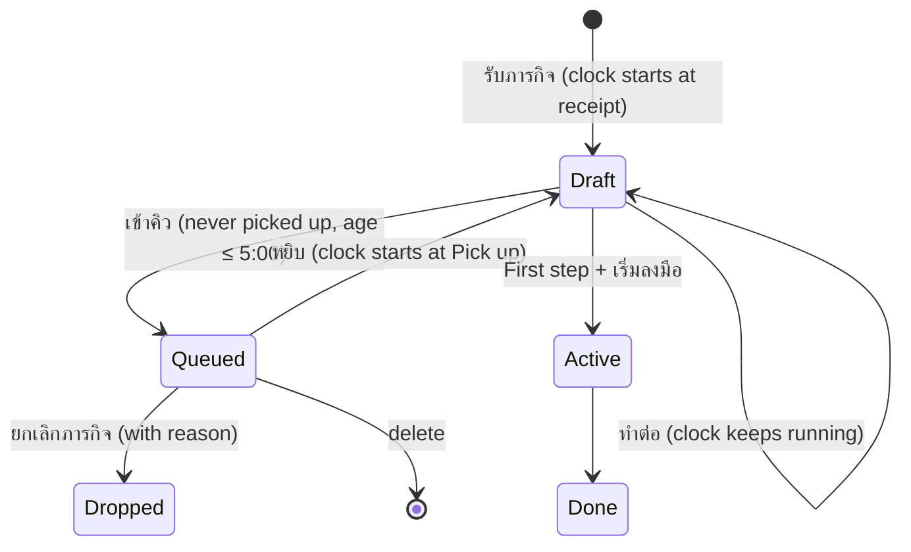

# Queue and Pick up

A requirement for `/grill-with-docs`. It describes the idea only. How the idea lands in this codebase is for the grill to find by reading the code. The target is a short grill, then `/implement` in the same session.

**How to grill this file:** everything under "Decided" is settled, and each rule carries its reason. Raise a decided rule only when it contradicts how the app already works, and name the code it contradicts. Ask the owner only the items under "Open questions", all in one round. The grill is done when each open question has an answer and every term in "Terms" is matched to the code or recorded in `CONTEXT.md`.

## The problem

Work arrives in bursts. Each Mission starts a Five-minute clock the moment it is received: the owner has five minutes to take the First step, or the start counts as late.

During a burst that rule backfires. The owner has two choices, and both are bad:

- **Skip noting the Mission.** The clock never starts, and the Mission is forgotten.
- **Note it.** The clock starts on a Mission the owner cannot touch yet, so a late start is certain.

The On-time start rate then measures the burst, not the owner's discipline.

## The idea

**The clock starts at commitment, not at receipt.**

The owner can note a Mission now and commit to it later. Noting it puts it in a Queue with no clock. Committing to it (Pick up) starts the clock. From then on the Mission behaves exactly as a newly received one does today.

## Terms

- **Mission (ภารกิจ):** one piece of work the owner received.
- **Instruction:** what the Mission asks for, in the requester's words. The minimum needed to note a Mission.
- **First step:** the smallest concrete action that begins the work. Writing it and tapping **เริ่มลงมือ** makes the Mission active; tapping **ทำก้าวแรกแล้ว** stops the Five-minute clock.
- **Five-minute clock:** the time from clock start to the First step. A First step at or under 5:00 is an **On-time start**. Over 5:00 is a **miss**.
- **Clock start:** the moment the clock begins. Today that is always receipt. After this feature it is Pick up for a Mission that went through the Queue, and receipt for every other Mission.
- **Draft:** a Mission received, or picked up, that has no First step yet. Its clock is running.
- **Queued (รอคิว):** a new state. A Mission noted for later, with no clock running.
- **Queue (เข้าคิว):** the action that moves a Draft into Queued.
- **Pick up (หยิบ):** the action that moves a Queued Mission back to Draft and starts its clock.
- **Resume (ทำต่อ):** reopening any Draft to continue it. It does not touch the clock.
- **Open:** a Mission that is not done, Dropped or deleted. Queued Missions are Open.

## Lifecycle

A Mission passes through the Queue **at most once**. A Draft that has been picked up can never be Queued again.

## Decided

### Screens and actions

1. **Capture form.** Next to the existing actions there is a **เข้าคิว** button. It needs only the Instruction; the First step and every other field may be empty. Tapping it saves the Mission as Queued and closes the form. The button appears only while the Mission may be Queued (rule R1). Otherwise it is hidden.
2. **Home list.** A **รอคิว** section sits below the work in progress and above the done Missions. Each Queued Mission shows its Instruction, its deadline if it has one, and how long it has waited. It shows no countdown. Its actions are **หยิบ**, **ยกเลิกภารกิจ** and delete.
3. **Pick up.** Tapping **หยิบ** records the Pick up time, which starts the clock, and opens the capture form with the Instruction filled in and the cursor in the First step. The timer reads **เหลือ 5:00**.
4. **Resume.** Any Draft on the list, picked up or not, shows **ทำต่อ**. It reopens the capture form with the clock where it is.

### Rules

Each rule needs at least one test named by its number.

- **R1 Queue gate.** Only a Draft that was never picked up and is at most five minutes past receipt can be Queued. Exactly 5:00 still counts. *Why:* once the five minutes have passed, the start is already a miss. Queueing then would erase the miss.
- **R2 One trip through the Queue.** A picked-up Mission can never be Queued again. *Why:* otherwise the owner could Pick up, let the clock run, and Queue it again to reset the clock indefinitely.
- **R3 Clock start.** Clock start is the Pick up time if there is one, otherwise the receipt time. The On-time start, the countdown and the miss are all measured from clock start.
- **R4 No clock while Queued.** A Queued Mission gets no five-minute alert, is not counted in the On-time start rate, and is never a miss, however long it waits. A Mission Dropped or deleted straight from the Queue is not a miss either. *Why:* the owner has not committed to it yet.
- **R5 Queued is Open.** A Queued Mission counts in the open count, the Deadline nudge and the Review nudge. *Why:* the Queue sets the clock aside, not the work. A deadline still arrives.
- **R6 No Status sentence while Queued.** A Queued Mission offers no **ส่งสถานะ**. *Why:* no work has started, so there is nothing to report.
- **R7 Home order.** The รอคิว section sorts by nearest deadline first, then Missions without a deadline. Within each group, the oldest received comes first. A Queued Mission whose deadline has passed leaves the section and joins the overdue group at the top of the list.
- **R8 Stale Queue in Review.** Review lists a Mission that has been Queued for **more than** 24 hours as **คิวค้าง**. Exactly 24 hours is not yet stale. The wait counts from the moment of Queueing.
- **R9 Stale Draft counts from clock start.** A Draft's age for **ร่างค้าง** counts from clock start. A Mission picked up after a long Queue starts fresh.
- **R10 Old data.** Missions saved before this feature have no Pick up time, so their clock start stays at receipt and past On-time start figures do not change. Stored data is not migrated.
- **R11 Export and import.** An export includes the Queue and Pick up times, and its file version goes up. A file of the previous version still imports; its Missions are simply never Queued.
- **R12 Double taps.** Two fast taps on เข้าคิว or หยิบ act once: one Queue, or one Pick up with one Pick up time.
- **R13 Theme.** New buttons and the รอคิว heading reuse the app's existing button and heading styles and its CSS variables, so light and dark mode both work.

### Worked examples

These use minute:second from receipt.

1. **Normal Queue.** Received at 0:00. Instruction typed, เข้าคิว at 1:30. The Mission waits two hours in รอคิว with no alert. หยิบ at 2:00:00 shows เหลือ 5:00. ทำก้าวแรกแล้ว at 2:03:00 is an **On-time start** (3:00 after Pick up).
2. **Late pick-up start.** Same as example 1, but ทำก้าวแรกแล้ว comes 6:00 after Pick up. That is a **miss**.
3. **Boundary of the gate.** Received at 0:00. เข้าคิว at exactly 5:00 is allowed. At 5:01 the button is gone, and the start will be a miss.
4. **No second trip.** Picked up, then the form is closed without a First step. The Mission shows ทำต่อ with its clock still running. เข้าคิว is not offered.
5. **Dropped from the Queue.** Queued for three days, then ยกเลิกภารกิจ with a reason. It is not a miss and it is not in the On-time start rate.
6. **Deadline while Queued.** Queued with a deadline of 17:00. At 17:01 it moves from รอคิว to the overdue group. It still has no clock.
7. **Review boundary.** Queued at 09:00 Monday. Review at 09:00 Tuesday does not list it. Review at 09:01 Tuesday lists it as คิวค้าง.

## Out of scope

Reordering the Queue by hand, notifications about the Queue, a limit on how many Missions may be Queued, and editing past Missions' times.

## Done when

1. Every rule R1–R13 and every worked example has a passing test, and the project's test and build commands pass.
2. By hand on the dev server, in light and dark mode: รับภารกิจ → type an Instruction → เข้าคิว → it waits under รอคิว with no clock → หยิบ → เหลือ 5:00, the Instruction filled in, the cursor in the First step → เริ่มลงมือ → active → ทำก้าวแรกแล้ว → เริ่มทันเวลา.

## Answered (grill, 2026-09-24)

1. **Editing while Queued:** yes. Tapping a Queued card opens the แก้ไข form; editing never starts the clock.
2. **What stays on Queue:** everything typed is kept, the First step included.
3. **Fit:** the app has both. The clock stops at **ทำก้าวแรกแล้ว**, not at **เริ่มลงมือ**, and Drop is **ยกเลิกภารกิจ**.
4. **Rate month (new):** the On-time start rate is grouped by the month of Clock start.
